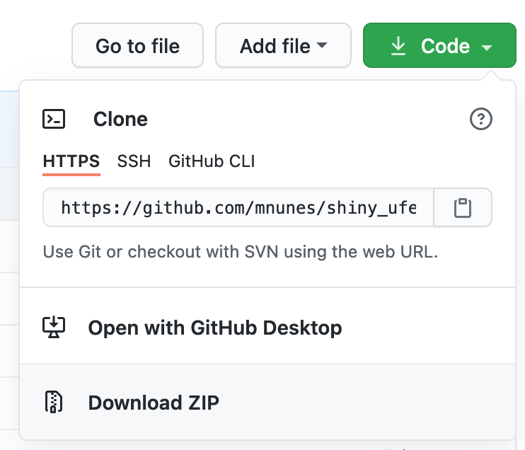

# Minicurso de Shiny

## Introdução

Esse minicurso é uma introdução prática à criação de _dashboards_ utilizando o pacote `shiny` do R.

Ele foi parte da programação científica da [XIV Semana da Estatística da UFES - "Estatística e Ciência de Dados"](https://docs.google.com/forms/d/e/1FAIpQLScLKYaYGwIWP8XBPCjXjv7sQx42xu7unbXItuDOmubJAZPoMQ/viewform), ocorrida durante os dias 3 e 4 de fevereiro de 2021.

## Software necessário

É necessário instalar os seguintes programas em seu computador:

- R: [https://cran.r-project.org/](https://cran.r-project.org/)
- RStudio: [https://www.rstudio.com/products/rstudio/download/](https://www.rstudio.com/products/rstudio/download/)
- Alguns pacotes do R devem ser instalados ou rodando o comando `source("https://raw.githubusercontent.com/mnunes/shiny_ufes/master/setup.R")` no seu RStudio ou clicando em [https://raw.githubusercontent.com/mnunes/shiny_ufes/master/setup.R](https://raw.githubusercontent.com/mnunes/shiny_ufes/master/setup.R) e copiando e colando seu conteúdo dentro do RStudio

## Como utilizar esse repositório

Clone os arquivos em seu computador utilizando o github ou clique no botão verde acima onde está escrito `Code` e escolha a opção `Download ZIP`

Acompanhe o curso com o material didático incluído na pasta `slides` e veja os códigos do R disponibilizados na pasta `exemplos`. Apenas essas duas pastas contém o material a ser utilizado no minicurso. Portanto, os outros arquivos podem ser ignorados sem prejuízo algum.

Esse minicurso foi preparado por [Marcus Nunes](https://marcusnunes.me), Professor Adjunto do Departamento de Estatística da UFRN.

